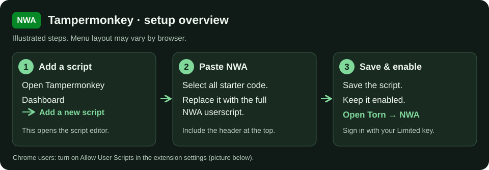
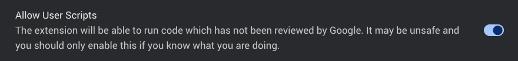
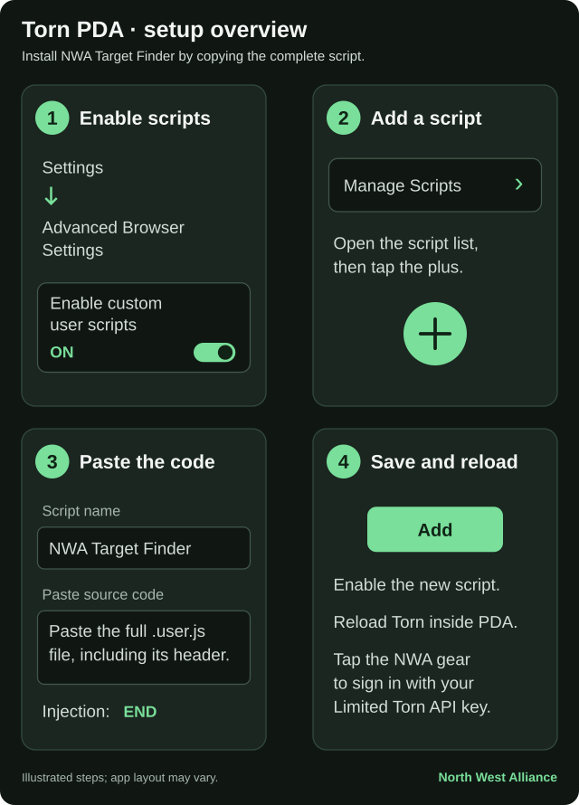
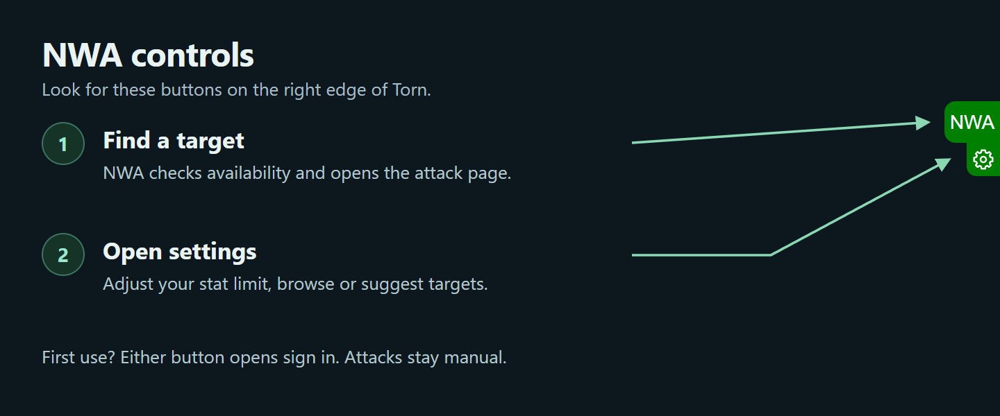
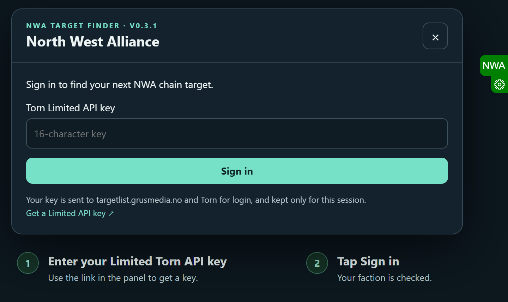

# NWA Target Finder

Find chain targets for **North West Alliance**.

## Install

[Install the latest NWA script](https://raw.githubusercontent.com/Grussniffer/torn-targetlist-script/codex/initial/dist/torn-targetlist.user.js), or open the [script](dist/torn-targetlist.user.js) and copy all its code.

### Tampermonkey

1. Install [Tampermonkey](https://www.tampermonkey.net/) in your browser.
2. Open its **Dashboard** and click **Add a new script**.
3. Replace the starter code with the copied script, save it, and make sure it is enabled.

On Chrome, enable **Allow User Scripts** in Tampermonkey's extension settings ([help](https://www.tampermonkey.net/faq.php?ext=dhdg&q=Q209)).

*Chrome screenshot from [Tampermonkey's official help](https://www.tampermonkey.net/faq.php?ext=dhdg&q=Q209).*

### Torn PDA

1. Open **Settings → Advanced Browser Settings** and turn on **Enable custom user scripts**.
2. Open **Manage scripts**, tap **+**, name it **NWA Target Finder**, and paste the copied script into **Paste source code**.
3. Leave **Injection time** at **END**, tap **Add**, make sure the script is enabled, and reload Torn inside PDA.

Torn PDA still needs testing on a device.

*The setup pictures illustrate the steps. Menu layouts may vary. See [Tampermonkey's guide](https://www.tampermonkey.net/faq.php?ext=dhdg&q=Q102) and [Torn PDA's guide](https://faq.kwack.dev/pda/scripts).*

## Start

Open Torn and click the green **NWA** button on the right edge. Sign in with your **Limited Torn API key** the first time.

NWA finds a target within your stat limit, checks availability, and opens its attack page. You start the attack yourself. If a target is unavailable, NWA tries another match, checking up to five per click.

The small **⚙** underneath opens settings, the target list, and suggestions. Your stat limit is saved between pages.

The backend is already set to [targetlist.grusmedia.no](https://targetlist.grusmedia.no). You only need your Torn key.

## Use

- **Targets:** browse the list or filter by estimated stats.
- **Check status:** check a target before opening its attack page.
- **Suggestions:** suggest a player or faction with a required comment.
- **Approvals:** faction leaders and co-leaders can approve or reject suggestions.

Your key is sent to the backend and Torn for login and kept only for your session. Only allowed factions can use the list. Battle stats are estimates; attacks are manual.

To update, use the install link or replace the code in your existing userscript and save it, then reload Torn. Disable any separate old **Torn Faction Target List** entry. The settings header shows the installed NWA version; **v0.3.1** has the compact green NWA tab and the white gear directly underneath.
